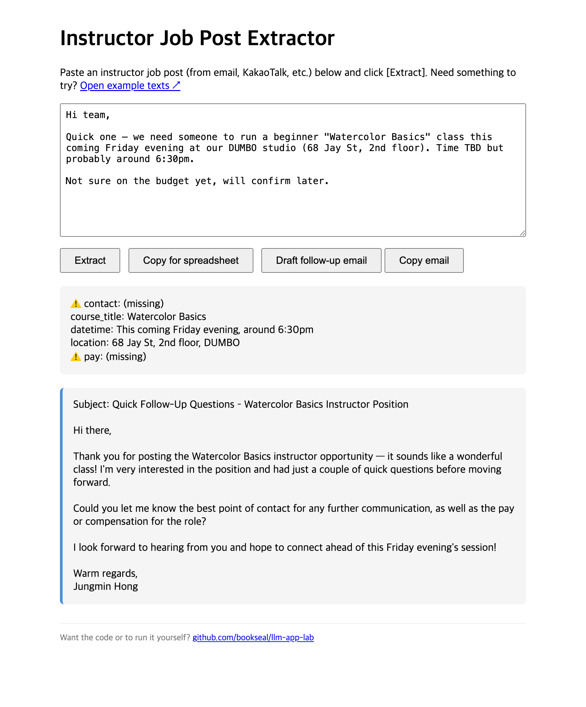

# llm-app-lab

> Learning to **build with LLMs** the hands-on way — one small, working app at a time.

This is my working repo for the **KSEPT Summer Program — Building with LLMs**. I'm
going from a single API call all the way to tools, RAG, and agents, and I learn each
idea by *shipping a tiny app that proves I understand it* — not by copying answers.

Every starter app in this course ships with **intentional bugs**. The fun part isn't
making them go away; it's reproducing the failure, explaining *why* it happens, fixing
it, and reading the diff before I accept it. My `git log` is the receipt.

📚 **Learning site (my concept notes):** <https://bookseal.github.io/llm-app-lab/>
&nbsp;·&nbsp; 📑 **Full curriculum:** [TUTORIAL.md](TUTORIAL.md)
&nbsp;·&nbsp; 🧱 Stack: **Flask · React + Vite · Anthropic SDK (`claude-sonnet-4-6`)**

---

## 📁 Repo layout

Every module's project lives under [`Projects/`](Projects/), one folder per build.
Each has its own README with run instructions.

```
.
├── Projects/
│   ├── Module_02_chat-app/            minimal Claude chat (/api/chat)
│   ├── Module_03_extractor/
│   │   ├── starter/                   forced tool_use + Pydantic (the starter)
│   │   └── webapp/  ⭐                 extended web app — extract + follow-up email
│   ├── Module_04_rag/                 RAG over a 14 CFR corpus (starter + eval harness)
│   ├── Module_04_embedding-similarity/ embeddings playground — cosine similarity
│   ├── Module_05B_finetune/          distill Claude → a tiny local ticket classifier
│   └── Module_05C_data-agent/        ~20-line agent loop over a read-only SQLite DB
├── docs/                             my concept notes (GitHub Pages)
└── TUTORIAL.md                       full curriculum reference
```

---

## 🔬 The hands-on builds

The stuff I actually built and broke and fixed. Each one isolates *one* LLM concept.

| Build | What it is | The concept it nails |
|---|---|---|
| **[Module_02_chat-app](Projects/Module_02_chat-app/)** | Minimal Claude chat over `/api/chat` | Stateless single-turn — and the gaps to production |
| **[Module_03_extractor/starter](Projects/Module_03_extractor/starter/)** | Single-turn structured extraction template | Forced tool call **+ Pydantic validation** as a safety layer |
| **[Module_03_extractor/webapp](Projects/Module_03_extractor/webapp/)** ⭐ | Paste a messy job post → structured fields + auto follow-up email | Forced `tool_use` **vs.** free-text generation |
| **[Module_04_rag](Projects/Module_04_rag/)** | Cited answers over a 14 CFR (FAA) corpus | Chunking · embeddings · vector store · citations |
| **[Module_04_embedding-similarity](Projects/Module_04_embedding-similarity/)** | Console playground: two phrases → cosine similarity | What embeddings *measure* (cross-lingual, no API) |
| **[Module_05B_finetune](Projects/Module_05B_finetune/)** | Route support tickets to 6 teams, three ways | Zero-shot → few-shot → **distilled classifier** (F1 compared) |
| **[Module_05C_data-agent](Projects/Module_05C_data-agent/)** | Ask a SQLite DB in English; it writes read-only SQL | The ~20-line **agent loop** + read-only-by-construction safety |

### ⭐ Module_03_extractor/webapp — the one I extended into a real web app

Paste an instructor job post (copied from email or KakaoTalk). Claude extracts five
structured fields, flags the blanks as **⚠️ missing**, copies everything as a TSV row
for a spreadsheet, and then *drafts a polite follow-up email asking only for the
fields that are missing*.



What I find genuinely cool about it — **the same model, used two opposite ways on one
screen**:

- **Extraction = text → data.** The output is machine-readable, so I *force* the shape
  with `tool_choice={"type": "tool", "name": "record_posting"}`. Every field is
  nullable, and the system prompt says *"return null rather than guess."*
- **Email = data → text.** The output is for a human, so I drop the tool entirely and
  let Claude write free-form prose.

That contrast — *the output format decides whether you force a tool* — is the whole
lesson, and I built an app to feel it instead of just reading it.
&nbsp; → run it: [Projects/Module_03_extractor/webapp/README.md](Projects/Module_03_extractor/webapp/README.md)

### 🧭 Module_04_embedding-similarity — building intuition for vectors

A tiny REPL: type two phrases, get their cosine similarity on a −1…1 scale. It runs a
**local multilingual model** (`paraphrase-multilingual-MiniLM-L12-v2`), so `"cat"` and
`"고양이"` score *high* across languages — no API key, no cost. Great for feeling why
`"I love this"` vs `"I hate this"` is **not** near −1 (same topic, opposite sentiment).

### 🎯 Module_05B_finetune — "fine-tuning" that actually runs

The Claude API doesn't expose self-serve fine-tuning of Claude itself, so this is the
runnable version of the same idea: **distillation**. Claude labels/generates the
training data, then a tiny local model (MiniLM embeddings + logistic-regression head)
learns the task. The three stages — zero-shot, few-shot, distilled — are scored on the
**same 48-ticket gold set**, so the F1 numbers show exactly what examples buy you when
the routing rules are hidden "house rules" that definitions alone can't teach.

---

## 🗺️ The path I'm walking

I take the course's [concept map](https://bookseal.github.io/llm-app-lab/) one module
at a time: **concept note → original slides → build the starter → mini quiz.**

| # | Module | What I take from it |
|---|------|------|
| 1 | Setup | Six tools + one shared `.env` for the API key |
| 2 | Foundations | First API call, a chat app, **fixing built-in bugs**, SSE streaming |
| 3 | Tools & Structure | Structured output, 4 levels: parseable → schema → tool-loop → MCP |
| 4 | Context | Indexing pipeline + RAG (chunking, embeddings, vector store, citations) |
| 5 | Architecture & Agents | A ~20-line agent loop, subagents, memory scope, multi-model |
| 6 | Production | Eval ladder, prompt-injection defense, observability |
| 7 | Workshop | Build something small enough to actually finish |

### My learning loop (why the `git log` is the point)

Each starter is **broken on purpose**. For every fix I run the same loop:

1. **Reproduce** — see the bug myself (e.g. the bot forgets the previous turn).
2. **Diagnose** — dig until I can explain the *mechanism*, not just the symptom.
3. **Fix** — tell Claude Code the *behavior I want*, ask for a plan first.
4. **Read the diff** — understand every change before accepting it.
5. **Verify** — re-run the original failure to confirm it's gone.
6. **Commit** — one commit per fix: `git commit -am "fix: <bug>"`.

→ So `git log` becomes my learning journal, and I can `git show <hash>` to walk anyone
through each fix, one diff at a time.

---

## ▶️ Running a project

Each build under `Projects/` is self-contained and has its own README with exact steps.
The general shape (Python projects):

```bash
cd Projects/<Module_..>          # e.g. Projects/Module_05B_finetune
python3.11 -m venv .venv && source .venv/bin/activate
pip install -r requirements.txt
# then follow that project's README
```

The API key comes from one shared `.env` (`ANTHROPIC_API_KEY`). Projects with a React
frontend (`Module_02_chat-app`, `Module_04_rag`) run the backend and `npm run dev`
frontend in two terminals — see their READMEs.

---

## 📒 About the learning site

The [`docs/`](docs/) folder is served at <https://bookseal.github.io/llm-app-lab/>. It's
my own **concept notes** — written in Korean (analogy-first), with English Mermaid
diagrams (a shared color/animation system in [`docs/mermaid-fx.js`](docs/mermaid-fx.js))
and instantly-graded mini quizzes for each module. The
[change log](https://bookseal.github.io/llm-app-lab/history.html) is auto-generated
from `git log` on every push to `main`
([scripts/gen_history.py](scripts/gen_history.py)).
