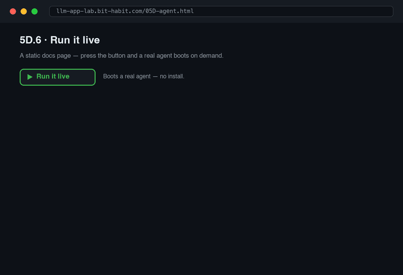
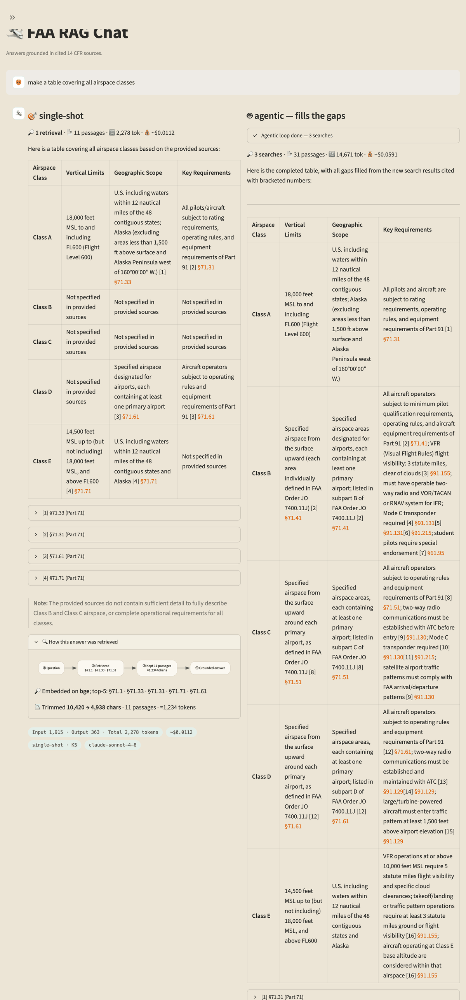
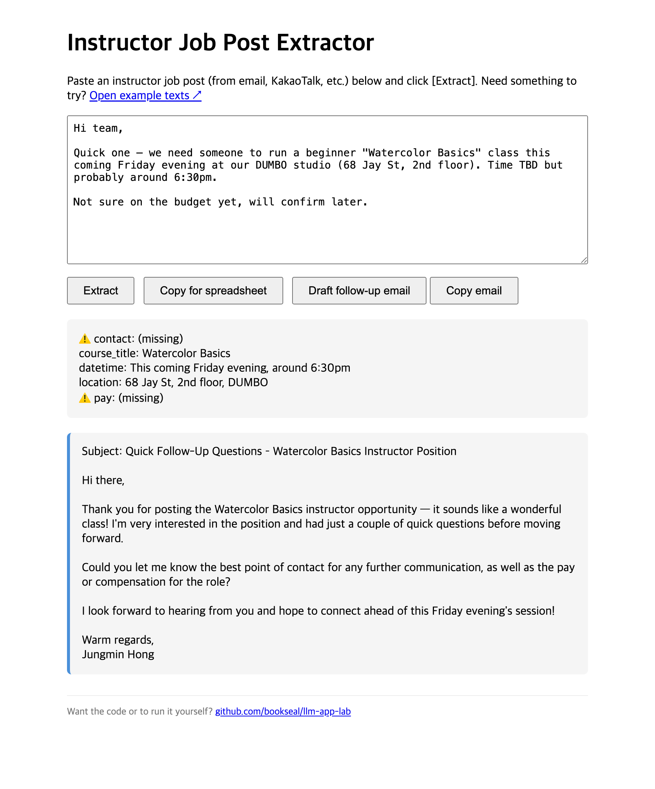
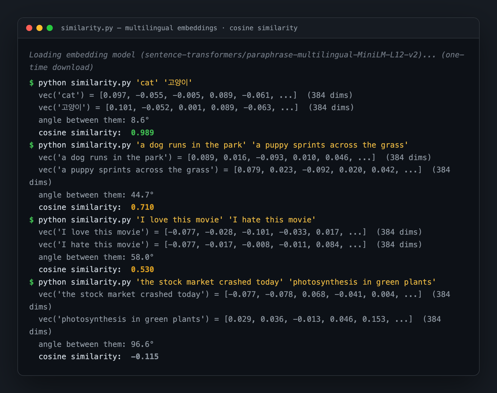
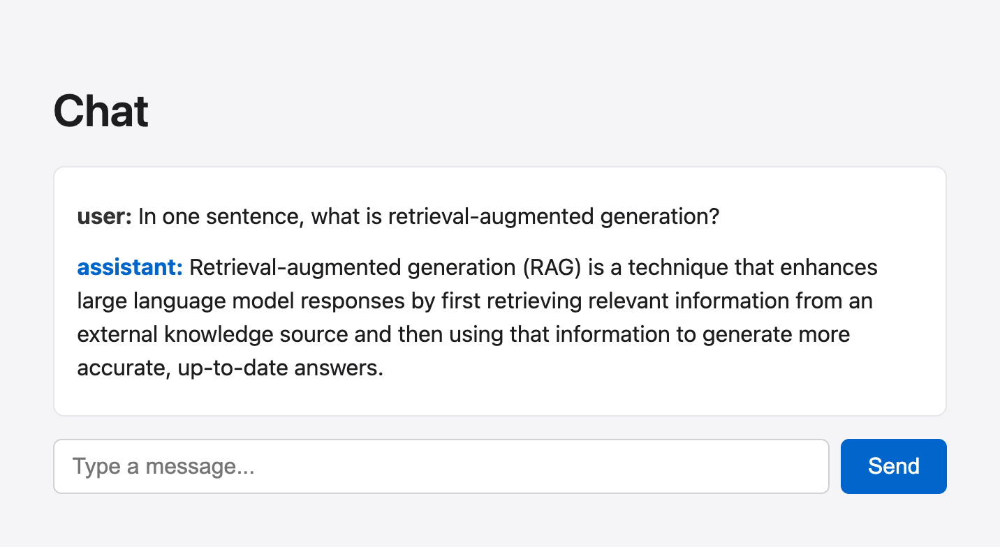

# llm-app-lab

> **A live, interactive course on building with LLMs — that I built *while taking it*.**
> I took **_Building with LLMs_ — a CS course taught by Larry Arnstein (CTO @ Clause;
> ex-Apple, Impinj, Xnor.ai; former UW faculty)** — and, instead of
> just following along, rebuilt its material into this as the lectures happened: every
> idea reworked into an analogy, an animated diagram, and a runnable app you can boot
> from inside the page. Learning the subject and authoring the textbook at the same time
> — the kind of thing the AI era makes possible for one person.



<sup>The **▶ Run it live** flow: a static page boots a real app on demand (k3s scale-to-zero) and embeds it right in the page — idle pods shut back down. **[Try it yourself →](https://llm-app-lab.bit-habit.com/05D-agent.html)**</sup>

**Jump to** · [See it live](#see-it-live) · [How it started](#how-it-started) · [Screenshots](#screenshots) · [What I sweated over](#what-i-sweated-over) · [The builds](#the-hands-on-builds) · [Curriculum](#the-curriculum-path) · [Run locally](#running-it-locally) · [Visualization](#the-visualization-stack) · [How "Run it live" works](#how-run-it-live-works)

---

## See it live

| | |
|---|---|
| 🎓 **The course** | **<https://llm-app-lab.bit-habit.com/>** — concept notes, animated diagrams, per-module quizzes |
| 🖥️ **Run a real app in the browser** | Press **▶ Run it live** on a project page — a real app boots and answers, embedded in the page: [data-analyst agent](https://llm-app-lab.bit-habit.com/05D-agent.html) · [job-post extractor](https://llm-app-lab.bit-habit.com/03B-extractor.html) |
| ⚙️ **How that works** | [launcher.html](https://llm-app-lab.bit-habit.com/launcher.html) — a static page that spins up Kubernetes pods on demand |
| 🧾 **The receipts** | [auto-generated change log](https://llm-app-lab.bit-habit.com/history.html) straight from `git log` |

🧱 Stack: **Flask · React + Vite · Anthropic SDK (`claude-sonnet-4-6`)** · **Mermaid + anime.js** for the visuals · **k3s (Kubernetes) + Traefik + cert-manager** for hosting and on-demand app instances.

---

## How it started

The course is **Larry Arnstein's _Building with LLMs_** (the KSEPT summer program) — taught
by the CTO of Clause, previously at Apple, Impinj, Xnor.ai, and on the UW CS faculty:
single API call → tools → RAG → agents. I took it live, and turned the
whole thing into a **product** rather than notes in a drawer — a teaching site I'd actually
want to learn from, plus the infrastructure to let anyone *run* the examples without
installing anything. This repo is both the coursework and the platform.

The way I learn is the point: every starter app ships with **intentional bugs**. I don't
just make them go away — I reproduce the failure, explain the *mechanism*, fix it, and read
the diff before accepting it. One commit per fix, so `git log` is a walkable learning
journal and `git show <hash>` narrates any single fix.

---

## Screenshots

People don't read walls of text, so — the four builds, at a glance. (The animation up top is
the fifth: any of these can boot live in the browser.)

**RAG over US federal aviation law** — built for the course's RAG tournament: §-cited answers
over **~1,297 pages of 14 CFR**, tuned by a 45-config overnight grid search instead of vibes —
and **graded 9/10 by the instructor, the top score in the class**. The shot: the same question
answered twice — single-shot (gaps show as honest "Not specified") vs. an agentic retrieval
loop that fills every cell with §-cited sources. You *see* the recall-vs-tokens trade-off.
Full write-up: [Module_04_rag](Projects/Module_04_rag/).



**⭐ Job-post extractor** — paste a messy posting → structured fields + an auto-drafted
follow-up email asking only for what's missing. One model, two opposite jobs on one screen.



**Embedding similarity** — two phrases → cosine similarity, with a local multilingual
model: `cat`↔`고양이` scores high across languages; `love`↔`hate` is *not* near −1.



**chat-app** — the smallest thing that talks to Claude: one endpoint, one
`client.messages.create`, streaming, and the lesson that the API is *stateless*.



---

## What I sweated over

The code is the easy part. These are the things I actually spent design thought on — and
what I'd want a fellow educator or engineer to look at first.

**Teaching as a craft, not a dump of notes.** The site is written the way I wish courses
were: **Korean, analogy-first prose** for intuition, **English diagrams** for precision, and
an **instantly-graded quiz** at the end of every section. 96 diagrams across the site, each
built to make *one* concept click — and **colored by shape, not by hand** (the renderer
infers a node's role from its geometry, so the whole site stays consistent).

**Measure, don't vibe.** For the RAG contest, while most entries were tuned by eyeballing the
5 practice questions, I built an eval harness that ran **45 retrieval configs overnight**
(chunking × embedding × retrieval × K) against a blind 14-question holdout, scored by
coverage/recall/MRR plus a free program check that cited §s really exist in the cited chunks.
The deployed config was picked by a rule, not a feeling: *within noise, take the cheaper one*
(~38% fewer tokens than the top-coverage config). Same discipline killed a better-recalling
agentic loop: 15,954 tokens capped vs ~2,256 single-shot — so single-shot shipped. That entry
was **graded 9/10 — top of the class — by the instructor, Larry Arnstein** (CTO @ Clause;
ex-Apple, Impinj, Xnor.ai; former UW faculty). Details: [Module_04_rag](Projects/Module_04_rag/).

**Animations that encode meaning, never decorate.** A **green ball tours a flow's common
path and turns yellow on a special-case branch** — so "the loop is the engine" is something
you *watch*. A **frozen node sits still while a trained one breathes** — the "only the small
head learns" idea, made visual. Nothing auto-plays a walkthrough; you set the pace.

**Run real apps from a static page — ephemeral, on demand.** A doc page can't start a
server, so a **launcher scales a Kubernetes deployment 0→1 on demand**, and the page embeds
the running app in an iframe right where you're reading. Idle apps scale **back to zero**
automatically — like a throwaway preview deploy, self-hosted on my k3s cluster. Details at
the end: [How "Run it live" works](#how-run-it-live-works).

**Learning by breaking.** Every starter is broken on purpose; I fix it the long way and keep
the diff. The `git log` — and the [auto-generated change log](https://llm-app-lab.bit-habit.com/history.html) — is the receipt.

---

## The hands-on builds

Each build isolates *one* LLM concept — small enough to fully understand, real enough to
break. They're the evidence behind the concept notes.

| Build | What it is | The concept it nails |
|---|---|---|
| **[Module_02_chat-app](Projects/Module_02_chat-app/)** | Minimal Claude chat over `/api/chat` | Stateless single-turn — and the gaps to production |
| **[Module_03_extractor/starter](Projects/Module_03_extractor/starter/)** | Single-turn structured extraction template | Forced tool call **+ Pydantic validation** as a safety layer |
| **[Module_03_extractor/webapp](Projects/Module_03_extractor/webapp/)** ⭐ | Messy job post → structured fields + auto follow-up email | Forced `tool_use` **vs.** free-text generation |
| **[Module_04_rag](Projects/Module_04_rag/)** | Contest entry: §-cited answers over ~1,297 pages of 14 CFR (FAA) — **graded 9/10, top of class** | §-boundary chunking · 45-config eval harness · token budgeting |
| **[Module_04_embedding-similarity](Projects/Module_04_embedding-similarity/)** | Two phrases → cosine similarity (local, no API) | What embeddings *measure* (cross-lingual) |
| **[Module_05B_finetune](Projects/Module_05B_finetune/)** | Route support tickets to 6 teams, three ways | Zero-shot → few-shot → **distilled classifier** (F1 compared) |
| **[Module_05C_data-agent](Projects/Module_05C_data-agent/)** | Ask a SQLite DB in English; it writes read-only SQL | The ~20-line **agent loop** + read-only-by-construction safety |

The ⭐ extractor is the one lesson I most wanted to *feel*: **the output format decides
whether you force a tool.** Extraction is text→data, so I force the schema with
`tool_choice`; the follow-up email is data→text, so I drop the tool and let Claude write
prose. Same model, opposite modes, one screen.

---

## The curriculum path

I take the course one module at a time — **concept note → original slides → build the
starter → mini quiz** — and each module's project page lives on the site.

| # | Module | What I take from it |
|---|------|------|
| 1 | Setup | Six tools + one shared `.env` for the API key |
| 2 | Foundations | First API call, a chat app, **fixing built-in bugs**, SSE streaming |
| 3 | Tools & Structure | Structured output, 4 levels: parseable → schema → tool-loop → MCP |
| 4 | Context | Indexing pipeline + RAG (chunking, embeddings, vector store, citations) |
| 5 | Architecture & Agents | A ~20-line agent loop; 3 project deep-dives: fine-tuning, VLA, data-agent |
| 6 | Production | Eval ladder, prompt-injection defense, observability |
| 7 | Workshop | Build something small enough to actually finish |

Full curriculum reference: [TUTORIAL.md](TUTORIAL.md).

---

## Running it locally

```
.
├── Projects/                          one folder per build (each has its own README)
│   ├── Module_02_chat-app/            minimal Claude chat (/api/chat)
│   ├── Module_03_extractor/           forced tool_use + Pydantic → web app
│   ├── Module_04_rag/                 contest-entry RAG over 14 CFR (app + 45-config eval harness)
│   ├── Module_04_embedding-similarity/ embeddings playground — cosine similarity
│   ├── Module_05B_finetune/           distill Claude → a tiny local ticket classifier
│   └── Module_05C_data-agent/         ~20-line agent loop over a read-only SQLite DB
├── docs/                              the teaching site (Mermaid + anime.js + quizzes)
├── infra/                             the "Run it live" launcher (Flask + k8s manifests)
└── TUTORIAL.md                        full curriculum reference
```

Each build is self-contained. The general shape (Python projects):

```bash
cd Projects/<Module_..>          # e.g. Projects/Module_05B_finetune
python3.11 -m venv .venv && source .venv/bin/activate
pip install -r requirements.txt  # then follow that project's README
```

The API key comes from one shared `.env` (`ANTHROPIC_API_KEY`). React-frontend projects
(`Module_02_chat-app`, `Module_04_rag`) run the backend and `npm run dev` in two terminals —
see their READMEs. Or skip setup entirely and press **▶ Run it live** on the project's page.

---

## The visualization stack

Two libraries, both loaded as ES modules straight from the jsDelivr CDN (no build step, no
`node_modules`). A page never touches them directly — it only writes `<div class="mermaid">`
blocks and a few `data-*` attributes, and loads **four shared scripts** that do the work in
one place:

| File | Library | Responsibility |
|---|---|---|
| [`docs/mermaid-fx.js`](docs/mermaid-fx.js) | `mermaid@11` (ESM) | Renders every `.mermaid` block; dark theme; **shape-based auto-coloring**; the reveal animation; the `core` glow; a `▶` replay button. Fires a `mermaid-fx:done` event when SVGs exist. |
| [`docs/flow-anim.js`](docs/flow-anim.js) | `animejs@4` (ESM) | Waits for `mermaid-fx:done`, then adds the meaning-encoding motion (below). Degrades gracefully if the CDN import fails; honors `prefers-reduced-motion`. |
| [`docs/style.css`](docs/style.css) | — | Every class the two scripts use (`.mermaid`, `.flowdot`, `.fnode-*`, `.fx-*`, …) lives here once. |
| [`docs/nav.js`](docs/nav.js) | — | The two-part sidebar rail (modules 1–7 + indented projects on top, current page's sections with scroll-spy below). |

Diagrams are colored by **shape, not by hand** — `["…"]` box = a step (blue), `{"…"}`
rhombus = a decision (purple), `[("…")]` cylinder = a store (amber), `(["…"])` stadium =
start/end (green); a node tagged `class X core;` gets a pulsing green glow. Animations are
declared with `data-*` (no per-page JS): the **touring ball** (`pulse-path` + `data-cycle`,
green→yellow on `data-alt`), **freeze/train**, and the **fx-morph** / **fx-mismatch**
teaching widgets. Full authoring contract:
[`TASK-05-projects-enrich.md`](TASK-05-projects-enrich.md); change log auto-generated by
[`scripts/gen_history.py`](scripts/gen_history.py).

---

## How "Run it live" works

The docs pages carry a **▶ Run it live** button (`docs/run.js`). A static page can't start a
server, so the button talks to a tiny **launcher API** that scales k8s deployments **0 ↔ 1
on demand** and reports when they're ready. Full principle write-up with animated diagrams:
[launcher.html](https://llm-app-lab.bit-habit.com/launcher.html).

```
browser (docs page)              launcher (Flask, infra/)            k3s
POST /launch {"app":"agent"} ──► kubectl scale --replicas=1  ──►  pod starts
GET  /status/agent  (poll)   ──► deployment readyReplicas?
                             ◄── {"state":"ready","url":"https://agent.bit-habit.com"}
…idle 20 min…                    kubectl scale --replicas=0  ──►  pod gone
```

Three apps are wired this way, each scaling to zero when idle:

| App | Served as | Why |
|---|---|---|
| **data-analyst agent** (5D) | a **real terminal** over the web via [ttyd](https://github.com/tsl0922/ttyd) | it's a REPL — the browser gets the exact session you'd get locally |
| **job-post extractor** (3B) | a server-rendered **Flask** app | it already serves its own UI |
| **RAG** (4B) | a **Streamlit** app | one process, same retrieval as the React/Flask version |

**Layout** — [`infra/launcher/app.py`](infra/launcher/app.py) is the API (`/launch`,
`/status/<app>`, an idle reaper, and an app allowlist); [`infra/apps/*/Dockerfile`](infra/apps/)
build each app image; [`infra/k8s.yaml`](infra/k8s.yaml) holds the RBAC, deployments (at
`replicas: 0`), services, and ingresses. Deploy steps are in [`infra/README.md`](infra/README.md).

**Security mirrors the lesson it teaches.** The launcher's Kubernetes role can *only*
get/scale the specific deployments named in `resourceNames` — it can't read secrets, create
pods, or touch other namespaces. `/launch` accepts only allowlisted app names; every app
container runs unprivileged; CORS is pinned to the docs origin. It's the same "don't hand out
the dangerous capability" principle as the read-only-SQL agent in Module 5 — applied to the
infrastructure itself.
